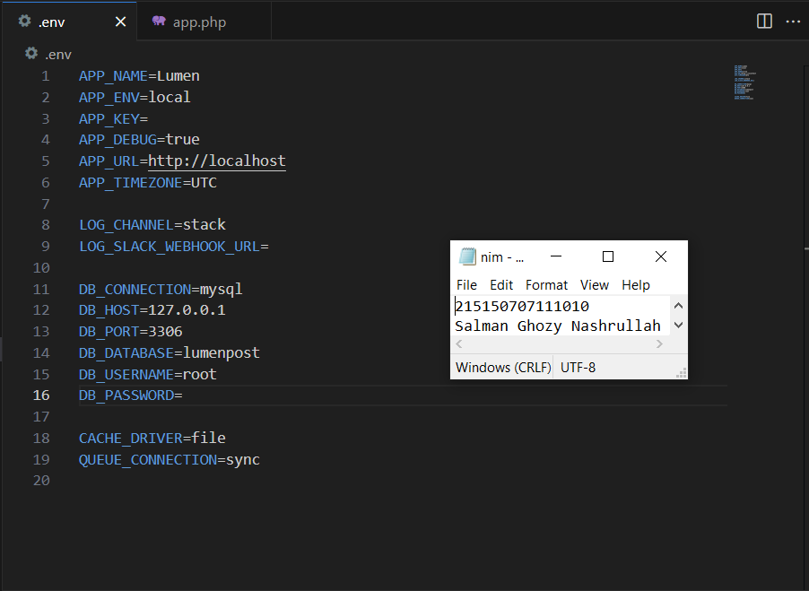
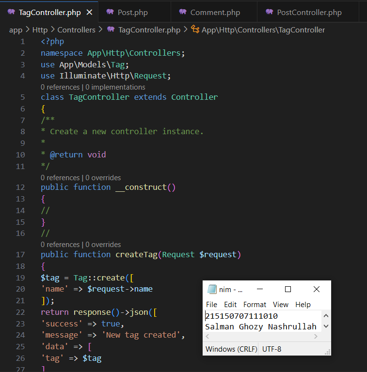
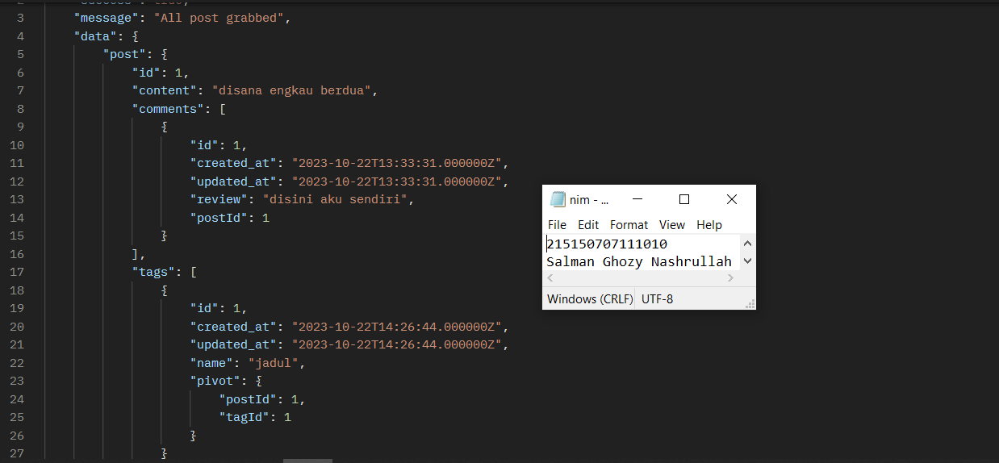

# Pemrograman-Integratif-A-Bab-7_215150707111010_Salman-Ghozy-Nashrullah

<h1>Langkah Percobaan</h1>
<h2>Pembuatan tabel</h2>

Berikut adalah tabel yang akan digunakan pada percobaan ini

 <table border="1">
        <tr>
            <td>posts</td>
            <td>id</td>
            <td>content(STRING)</td>
        </tr>
        <tr>
            <td>comments</td>
            <td>id</td>
            <td>review(STRING)</td>
        </tr>
        <tr>
            <td>tags</td>
            <td>id</td>
            <td>name</td>
        </tr>
        <tr>
            <td>post_tag</td>
            <td>postId</td>
            <td>tagId</td>
        </tr>
    </table>
<h3>Langkah ke-1</h3>

1. Sebelum membuat migrasi <i>database</i> atau membuat tabel pastikan <i>server database</i>
aktif kemudian pastikan sudah membuat <i>database</i> dengan nama <i>lumenpost</i>

<h3>Langkah ke-2</h3>

2. Kemudian ubah konfigurasi<i> database pada <i>file .env</i> menjadi seperti berikut

<i>
DB_CONNECTION=mysql
 
DB_HOST=127.0.0.1
 
DB_PORT=3306
 
DB_DATABASE=lumenpost
 
DB_USERNAME=root
</i>
<i>
DB_PASSWORD=</i>
  

<h3>Langkah ke-3</h3>

3. Setelah mengubah konfigurasi pada <i>file .env</i>, kita juga perlu menghidupkan
beberapa <i> library</i> bawaan dari <i>lumen</i> dengan membuka <i>file app.php</i> pada <i>folder
bootstrap</i> dan mengubah baris ini 

<i>
// $app->withFacades(); 
// $app->withEloquent();</i>   

 menjadi

<i>$app->withFacades();<i> 
</i> $app->withEloquent(); </i>

<h3>Langkah ke-4</h3>

4. Setelah itu jalankan <i>command</i> berikut untuk membuat <i>file migration</i>

<i>php artisan make:migration create_posts_table 
php artisan make:migration create_comments_table 
php artisan make:migration create_tags_table 
php artisan make:migration create_post_tag_table 
</i>  

<h3>langkah ke-5</h3>

5. Ubah fungsi <i>up()</i> pada <i>file migrasi create_posts_table</i>

#sebelumnya
 ...
 public function up()
 {
 Schema::create('posts', function (Blueprint $table) {
 $table->id();
 $table->timestamps();
 });
 }
 ...

 #diubah menjadi
 ...
 public function up()
 {
 Schema::create('posts', function (Blueprint $table) {
 $table->id();
 $table->timestamps();
 $table->string('content');
 });
 }
 ...

<h3>langkah ke-6</h3>

5. Ubah fungsi <i>up()</i> pada <i>file create_comments_table</i>

#sebelumnya
 ...
 public function up()
 {
 Schema::create('posts', function (Blueprint $table) {
 $table->id();
 $table->timestamps();
 });
 }
 ...

 #diubah menjadi
 ...
 public function up()
 {
 Schema::create('posts', function (Blueprint $table) {
 $table->id();
 $table->timestamps();
 $table->string('review');
 $table->foreignId('postId')->unsigned();
 });
 }
 ...

<h3>langkah ke-7</h3>

5. Ubah fungsi <i>up()</i> pada <i>file create_tags_table</i>

#sebelumnya
 ...
 public function up()
 {
 Schema::create('posts', function (Blueprint $table) {
 $table->id();
 $table->timestamps();
 });
 }
 ...

 #diubah menjadi
 ...
 public function up()
 {
 Schema::create('posts', function (Blueprint $table) {
 $table->id();
 $table->timestamps();
 $table->string('name');
 });
 }
 ...

<h3>langkah ke-8</h3>

5. Ubah fungsi <i>up()</i> pada <i>file migrasi create_post_tag_table</i>

#sebelumnya
 ...
 public function up()
 {
 Schema::create('posts', function (Blueprint $table) {
 $table->id();
 $table->timestamps();
 });
 }
 ...

 #diubah menjadi
 ...
 public function up()
 {
 Schema::create('posts', function (Blueprint $table) {
 $table->id();
 $table->timestamps();
 $table->foreignId('postId')->unsigned();
 $table->foreignId('tagId')->unsigned();
 });
 }
 ...

<h3>langkah ke-9</h3>

9. Kemudian jalankan <i>command</i>

<i>php artisan migrate</i>  

<h2>Pembuatan Model</h2>
<h3>langkah ke-1</h3>

1. Buatlah <i>file</i> dengan nama <i>Post.php</i> dan isi dengan baris kode berikut

<i><?php
 namespace App\Models;
 use Illuminate\Database\Eloquent\Model;
 class Post extends Model
 {
 /**
 * The attributes that are mass assignable.
 *
 * @var string[]
 */
 protected $fillable = [
 'content'
 ];
 /**
 * The attributes excluded from the model's JSON form.
 *
 * @var string[]
 */
 protected $hidden = [];
 }</i>  

<h3>langkah ke-2</h3>

2. Buatlah <i>file</i> dengan nama <i>Comment.php</i> dan isi dengan baris kode berikut

<i>
 <?php
 namespace App\Models;
 use Illuminate\Database\Eloquent\Model;
 class Comment extends Model
 {
 /**
 * The attributes that are mass assignable.
 *
 * @var string[]
 */
 protected $fillable = [
 'review'
 ];
 /**

 * The attributes excluded from the model's JSON form.
 *
 * @var string[]
 */
 protected $hidden = [];
 }  

<h3>langkah ke-3</h3>

2. Buatlah <i>file</i> dengan nama <i>Tag.php</i> dan isi dengan baris kode berikut

<i>
 <?php
 namespace App\Models;
 use Illuminate\Database\Eloquent\Model;
 class Tag extends Model
 {
 /**
 * The attributes that are mass assignable.
 *
 * @var string[]
 */
 protected $fillable = [
 'review'
 ];
 /**

 * The attributes excluded from the model's JSON form.
 *
 * @var string[]
 */
 protected $hidden = [];
 }  

<h2>Relasi One-to-Many</h2>
<h3>langkah ke-1</h3>

1. Tambahkan fungsi <i>comments()</i> pada <i>file Post.php</i>

<i> <?php
 namespace App\Models;
 use Illuminate\Database\Eloquent\Model;
 class Post extends Model
 {
 ...

 // fungsi comments
 public function comments()
 {
 return $this->hasMany(Comment::class, 'postId');
 }
 }  

<h3>langkah ke-2</h3>

1. Tambahkan fungsi <i>post()</i> dan atribut <i>postId</i> pada <i>file Comment.php</i>

<i><?php
 namespace App\Models;
 use Illuminate\Database\Eloquent\Model;
 class Comment extends Model
 {
 ...
 protected $fillable = [
 'review',
 'postId' // atribut postId
 ];
 /**
 * The attributes excluded from the model's JSON form.
 *
 * @var string[]
 */
 protected $hidden = [];
 public function post()
 {
 return $this->belongsTo(Post::class, 'postId');
 }
 }</i>  

<h3>langkah ke-3</h3>

3. Buatlah <i>file PostController.php</i> dan isilah dengan baris kode berikut

<i><?php
 namespace App\Http\Controllers;
 use App\Models\Post;
 use Illuminate\Http\Request;
 class PostController extends Controller

 {
 /**
 * Create a new controller instance.
 *
 * @return void
 */
 public function __construct()
 {
 //
 }
 //
 public function createPost(Request $request)
 {
 $post = Post::create([
 'content' => $request->content,
 ]);
 return response()->json([
 'success' => true,
 'message' => 'New post created',
 'data' => [
 'post' => $post
 ]
 ]);
 }
 public function getPostById(Request $request)
 {
 $post = Post::find($request->id);
 return response()->json([
 'success' => true,
 'message' => 'All post grabbed',
 'data' => [
 'post' => [
 'id' => $post->id,
 'content' => $post->content,
 'comments' => $post->comments,
 ]
 ]
 ]);
 }
 }  

<h3>langkah ke-4</h3>

4. Buatlah <i>file CommentController.php</i> dan isilah dengan baris kode berikut

<i><?php
 namespace App\Http\Controllers;
 use App\Models\Post;
 use Illuminate\Http\Request;
 class CommentController extends Controller

 {
 /**
 * Create a new controller instance.
 *
 * @return void
 */
 public function __construct()
 {
 //
 }
 //
 public function createComment(Request $request)
 {
 $comment = Comment::create([
 'review' => $request->review,
 'postId' => $request->postId,
 ]);
 return response()->json([
 'success' => true,
 'message' => 'New post created',
 'data' => [
 'comment' => $comment
 ]
 ]);
 }
 }  

<h3>langkah ke-5</h3>

5. Tambahkan baris berikut pada <i>routes/web.php</i>

<i><?php
 ...
 $router->group(['prefix' => 'posts'], function () use ($router) {
 $router->post('/', ['uses' => 'PostController@createPost']);
 $router->get('/{id}', ['uses' => 'PostController@getPostById']);
 });
 $router->group(['prefix' => 'comments'], function () use ($router) {
 $router->post('/', ['uses' => 'CommentController@createComment']);
 });  

<h3>langkah ke-6<h3>

Buatlah satu <i>post</i> menggunakan <i>Postman</i>

<h3>langkah ke-7<h3>

Buatlah satu <i>comment</i> menggunakan <i>Postman</i>

<h3>langkah ke-8<h3>

Tampilkan <i>post</i> menggunakan <i>Postman</i>

<h2>Relasi Many-to-Many</h2>
<h3>langkah ke-1</h3>

1. Tambahkan fungsi <i>tags()</i> pada <i>file Post.php</i>

<i><?php
 namespace App\Models;
 use Illuminate\Database\Eloquent\Model;

 class Post extends Model
 {
 ...
 public function tags()
 {
 return $this->belongsToMany(Tag::class, 'post_tag', 'postId', 'tagId');
 }
 }
 </i>  

<h3>langkah ke-2</h3>

2. Tambahkan fungsi <i>posts()</i> pada file <i>Tag.php</i>

<i><?php
 namespace App\Models;
 use Illuminate\Database\Eloquent\Model;

 class Tag extends Model
 {
 ...
 public function posts()
 {
 return $this->belongsToMany(Tag::class, 'post_tag', 'tagId', 'postId');
 }
 }
  

<h3>langkah ke-3</h3>

3. Buatlah <i>file TagController.php</i> dan isilah dengan baris kode berikut

<i><?php
 namespace App\Http\Controllers;
 use App\Models\Tag;
 use Illuminate\Http\Request;
 class TagController extends Controller
 {
 /**
 * Create a new controller instance.
 *
 * @return void
 */
 public function __construct()
 {
 //
 }
 //
 public function createTag(Request $request)
 {
 $tag = Tag::create([
 'name' => $request->name
 ]);
 return response()->json([
 'success' => true,
 'message' => 'New tag created',
 'data' => [
 'tag' => $tag
 ]
 ]);
 }
 }  

<h3>langkah ke-4</h3>

4. Tambahkan fungsi <i>addTag</i> dan <i>response tags</i> pada <i>PostController.php</i>

<i><?php
 namespace App\Http\Controllers;
 use App\Models\Post;
 use Illuminate\Http\Request;
 class PostController extends Controller
 {
 ...
 public function getPostById(Request $request)
 {
 $post = Post::find($request->id);
 return response()->json([
 'success' => true,
 'message' => 'All post grabbed',
 'data' => [
 'post' => [
 'id' => $post->id,
 'content' => $post->content,
 'comments' => $post->comments,
 'tags' => $post->tags, //response tags
 ]
 ]
 ]);
 }
 public function addTag(Request $request)
 {
 $post = Post::find($request->id);
 $post->tags()->attach($request->tagId);
 return response()->json([
 'success' => true,
 'message' => 'Tag added to post',
 ]);
 }
 }  
    

<h3>langkah ke-5</h3>

5. Tambahkan baris berikut pada <i>routes/web.php</i>

<i>$router->group(['prefix' => 'posts'], function () use ($router) {
 $router->post('/', ['uses' => 'PostController@createPost']);
 $router->get('/{id}', ['uses' => 'PostController@getPostById']);
 $router->put('/{id}/tag/{tagId}', ['uses' => 'PostController@getPostById']); //
 });
 ...
 $router->group(['prefix' => 'tags'], function () use ($router) {
 $router->post('/', ['uses' => 'TagController@createTag']);
 });  

<h3>langkah ke-6</h3>

6. Buatlah satu <i>tag</i> menggunakan <i>Postman</i>

<h3>langkah ke-7</h3>

7. Tambahkan <i>tag</i> “jadul” pada <i>post</i> “disana engkau berdua”

<h3>langkah ke-8</h3>

8. Tampilkan <i>post</i> “disana engkau berdua” menggunakan <i>Postman</i>

<h3>langkah ke-9</h3>

9. Buatlah postingan “tanpamu apa artinya” menggunakan <i>Postman</i>

<h3>langkah ke-10</h3>

10. Tambahkan <i>tag</i> “jadul” pada postingan “tanpamu apa artinya”

<h3>langkah ke-11</h3>

11. Buatlah <i>tag</i> “lagu” menggunakan <i>Postman</i>

<h3>langkah ke-12</h3>

12. Tambahkan <i>tag</i> “lagu” pada postingan “tanpamu apa artinya”

<h3>langkah ke-13</h3>

13. Tampilkan Tampilkan <i>post</i> pertama</i>

<h3>langkah ke-14</h3>

14. Tampilkan <i>Tampilkan <i>post</i> kedu</i>

